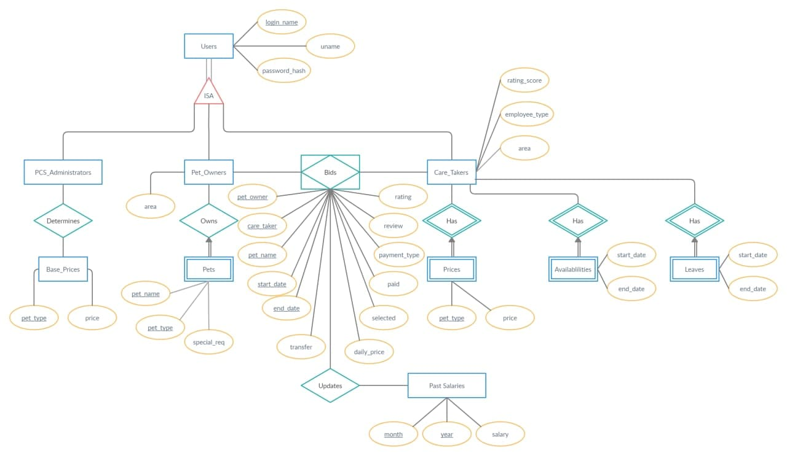

# CS2102_2021_S1_41
AY20/21 Sem1 CS2102 Database Systems Group Project (Team 41)
* Ko Gi Hun (@nordic96)
* @AugGust
* Chan Wei Qiang Jason (@jasonchanwq)
* Putra Mohammad Danish Bin Mohd Rafee (@iamputradanish)
* Chew Zhao En (@chewzhaoen) 
## W6 Project Deliverables
### 1. ER Diagram Model

### 2. Constraints
1. Users have to belong to Admin, Pet Owners or Caretakers. 
1. User can belong to multiple groups (i.e. Pet Owners & Care Takers or Pet Owners & Care Takers & Admin).
1. Price_List of Care_Takers will record down the available pet types the Care Takers are capable of handling.
1. For part-time Care Takers, they have to specify their own availability for the current year + the next year. For full-time Care Takers, they are assumed to be available during working hours (?) unless they are on leave.
1. Leaves will be documented in the Leave entity, where a start date and end date is specified. PCS Admin will approve/reject the leave based on availability of Care Takers (need to elaborate?).
1. Cannot self approve leave
1. Attribute EmployeeType of Care_Takers will record whether they are full-time or part-time Care Takers.
1. Pet Owners will be able to search Care Takers based on criteria - for example, at least 4 stars rating or maximum price, then manually select the Care Taker they want.
1. Automatic selection based on same/similar area.

### 3. Non-trivial constraints with triggers

### 4. Justification of any serial type